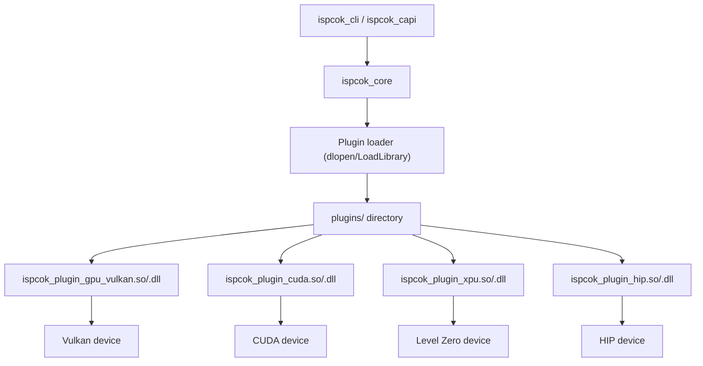

# GPU Accelerator Backends

Feature Name: 2026-08-13-gpu-accelerator-backends
Updated: 2026-08-13

## Description

Replace the four placeholder accelerator modules (gpu_vulkan, cuda, xpu, hip) with real GPU compute backends that execute an identical FP32 matrix multiplication benchmark and report genuine throughput metrics. Each backend ships as a standalone dynamic plugin so the ispcok_core library never links GPU SDKs. Backends degrade gracefully to `not_supported` with an explanatory message when the SDK is absent at build time or no physical device exists at run time. The feature is fully buildable and testable in GPU-less environments; the Vulkan backend is verified for real execution using the Mesa lavapipe software device.

Confirmed scope decisions:

- Integration model: dynamic plugins, SDK-free core.
- Workload: one generic FP32 matrix multiplication kernel per backend, same problem size across all backends.
- GPU-less verification: Vulkan via lavapipe software device; CUDA, HIP, xpu via degradation-path unit tests only.
- Out of scope: gpu_dx12 and npu remain `not_implemented` placeholders.

## Architecture



The ispcok_core plugin loader (src/core/plugin_loader.cpp) enumerates the plugin directory, loads each module via the existing ABI v1 entrypoint `ispcok_get_module_v1`, and returns `PluginModule` instances. CollectModules (src/core/engine.cpp:288) replaces a builtin module with any plugin of the same id. Each real backend therefore shadows its builtin placeholder automatically when present in the plugin directory.

## Components and Interfaces

### plugins/common

Shared, SDK-free host-side code reused by all four backends:

- `matmul_workload.h`: Defines the fixed problem size N (1024 x 1024), a deterministic pseudo-random matrix initializer, and a host-side checksum validator. Also provides the GFLOPS formula `gflops = 2 * N^3 / elapsed_s / 1e9`.
- `report_helpers.h`: Builds an `IsPcOkPluginResultV1` from elapsed time, computed GFLOPS, and a status message. Encapsulates the zero-score degradation convention so each backend produces consistent output.

### plugins/vulkan (id gpu_vulkan)

- `vulkan_backend.cpp`: Creates a Vulkan instance, enumerates physical devices, selects the first usable device (preferring discrete), creates a logical device and a compute queue. Executes the matrix multiplication compute shader with timing via timestamp queries; validates the checksum on the host.
- `matmul.comp`: GLSL compute shader performing the shared matrix multiplication kernel. Compiled at build time to SPIR-V via `glslangValidator` (shipped with the Vulkan SDK) and embedded into the plugin as a byte array, removing runtime file dependencies.

Degradation paths inside `run()`:

- No usable physical device or incompatible driver: return score 0, message `"gpu_vulkan: no usable Vulkan device available"`.
- Build without Vulkan SDK: plugin not produced; the builtin placeholder reports `not_supported` with `"gpu_vulkan: backend not compiled"`.

### plugins/cuda (id cuda)

- `cuda_backend.cpp`: Calls `cudaGetDeviceCount`; when zero, returns the degradation result with message `"cuda: no CUDA device available"`. Otherwise selects device 0, copies matrices to device memory, launches the matrix multiplication kernel, times with CUDA events, and validates the checksum.
- `matmul_kernel.cu`: CUDA kernel for the shared matrix multiplication workload.

### plugins/xpu (id xpu)

- `ze_backend.cpp`: Calls `zeInit`, `zeDriverGet`, and `zeDeviceGet`; when no driver or device is found, returns `"xpu: no Level Zero device available"`. Otherwise creates a module from the same SPIR-V binary used by the Vulkan backend (both accept SPIR-V), launches the kernel on a command list, times with Level Zero events, and validates the checksum.

### plugins/hip (id hip)

- `hip_backend.cpp`: Calls `hipGetDeviceCount`; when zero, returns `"hip: no HIP device available"`. Otherwise mirrors the CUDA backend structure (HIP is CUDA-compatible at the source level) using HIP events for timing.

### Plugin ABI and degradation convention

The existing ABI v1 (include/ispcok/plugin_api.h) is retained unchanged. Because `IsPcOkPluginResultV1` has no status field, the host adopts the following convention in `PluginModule::run()`:

- rc == 0 and score > 0: status `ok`.
- rc == 0 and score == 0 with a non-empty message: status `not_supported` with that message.
- rc != 0 or invalid metrics: status `error` (existing guardrails unchanged).

This is fully backward compatible: existing sample plugins (mock, bad_*) always return either a positive score or a non-zero rc, so their behavior is unchanged.

## Data Models

### Plugin result (unchanged ABI v1)

```
IsPcOkPluginResultV1 {
    double score;                      // 0 for not_supported, positive for ok
    const char* message;               // degradation reason or success summary
    const IsPcOkPluginMetricV1* metrics;
    size_t metric_count;
}
```

### Metrics reported by every successful backend

| Metric | Unit | Meaning |
|--------|------|---------|
| `fp32_gflops` | GFLOPS | Achieved FP32 matrix multiplication throughput |
| `elapsed_ms` | ms | Wall time for the timed kernel execution |
| `checksum` | double | Host-validated result checksum |

Score is derived as `ClampScore(fp32_gflops / k)` with a backend-agnostic scale factor k calibrated so that a mid-range consumer GPU scores near the middle of the 0-100 range. The same k is used for all four backends so scores are comparable.

## Correctness Properties

- A backend reports `ok` only after the computed matrix checksum matches the host reference; a mismatch yields status `error` with message stating the result mismatch.
- All four backends use the identical problem size N, initializer, checksum function, and GFLOPS formula, guaranteeing cross-backend comparability.
- A backend reports `not_supported` (score 0) exactly when its device is absent or unusable; it never reports fabricated scores.
- A backend returns a bounded execution: the plugin uses a fixed number of kernel iterations and a finite dispatch count so a hanging driver probe cannot stall the whole benchmark run (plugin run is already invoked under SEH on MSVC; the host timeout bound is satisfied by the plugin's finite workload).
- Score, metrics, and message are finite; the host guardrails (non-finite score, null metrics with non-zero count, metric_count > 1024) reject malformed plugin results.
- The presence of a real plugin does not change the ids or categories of the accelerator modules, so scenario definitions (game_engine uses gpu_vulkan; llm_infer_server uses cuda/npu) keep working.

## Error Handling

| Scenario | Plugin behavior | Host-visible status |
|----------|-----------------|---------------------|
| SDK not present at build time | plugin not built | `not_supported` (`"<id>: backend not compiled"`) via builtin placeholder |
| No usable device at run time | score 0 + reason message | `not_supported` |
| Device present but initialization fails | score 0 + reason message | `not_supported` |
| Kernel result checksum mismatch | score 0 + reason message | `error` |
| Host memory or API resource failure | score 0 + reason message | `error` |
| Plugin crashes inside run() | MSVC SEH catches | `error` (`"plugin crashed during run()"`) |
| Plugin returns non-finite score / malformed metrics | existing guardrails | `error` |

Degradation and error modules are excluded from scenario score aggregation by the existing `score_of()` fallback path in PredictScenario (src/core/engine.cpp:161), which substitutes the term fallback for any non-`ok` module.

## Test Strategy

### Unit tests (tests/ispcok_tests.cpp, extended)

- `GpuPluginsDegradeGracefully`: runs each accelerator module through `ispcok::Run` and asserts that every module returns either `ok` with positive score or `not_supported`/`error` with a non-empty message; never `not_implemented`, never a crash, never a zero-score `ok`.
- `GpuPluginsNoDeviceMessage`: when a backend is `not_supported`, asserts the message identifies the backend id and mentions the missing device or missing compilation.
- `GpuPluginOverride`: when the real plugin is present in the plugin directory, asserts the module id is still `gpu_vulkan`/`cuda`/`xpu`/`hip` and `is_plugin()` is true, confirming override of the builtin placeholder.
- Existing guardrail tests (bad plugins) and scenario tests remain green.

### GPU-less build regression

- CMake configuration without any GPU SDK completes without error; no real plugin targets are created; ispcok_core, ispcok_capi, ispcok_cli, pc_benchmark and ispcok_tests build and pass.
- CI workflow unchanged and green on windows-2022 (no GPU): GPU backends are disabled by default so release artifacts are unaffected.

### Vulkan real-execution verification (lavapipe)

- Script `scripts/test_vulkan_plugin_lavapipe.sh`: ensures a Mesa Vulkan driver (lavapipe/llvmpipe) is installed via apt, builds the Vulkan plugin with the Vulkan SDK headers, then runs `ispcok_cli --plugin-dir` with the gpu_vulkan module and asserts `status == "ok"` and `fp32_gflops > 0`.
- This script is the acceptance gate for Requirement 1 AC5 and is runnable in the local development container.

### Manual verification on real hardware

- Users with an NVIDIA GPU build the cuda plugin and run `ispcok_cli --plugin-dir <dir> run --modules cuda`; the message reports measured GFLOPS.
- The same procedure applies to HIP (AMD) and xpu (Intel) devices.

## References

[^1]: (include/ispcok/plugin_api.h) - [Plugin ABI v1 definitions](include/ispcok/plugin_api.h)
[^2]: (src/core/plugin_loader.cpp) - [Plugin loading and result guardrails](src/core/plugin_loader.cpp)
[^3]: (src/core/engine.cpp#L288) - [CollectModules plugin override of builtin modules](src/core/engine.cpp)
[^4]: (src/core/engine.cpp#L161) - [Scenario score fallback for non-ok modules](src/core/engine.cpp)
[^5]: (samples/plugins/mock_gpu_plugin.cpp) - [Reference plugin structure](samples/plugins/mock_gpu_plugin.cpp)
[^6]: (CMakeLists.txt) - [Optional feature flags and plugin targets](CMakeLists.txt)
[^7]: (docs/DEVELOPMENT.zh-CN.md) - [Development documentation to update](docs/DEVELOPMENT.zh-CN.md)
