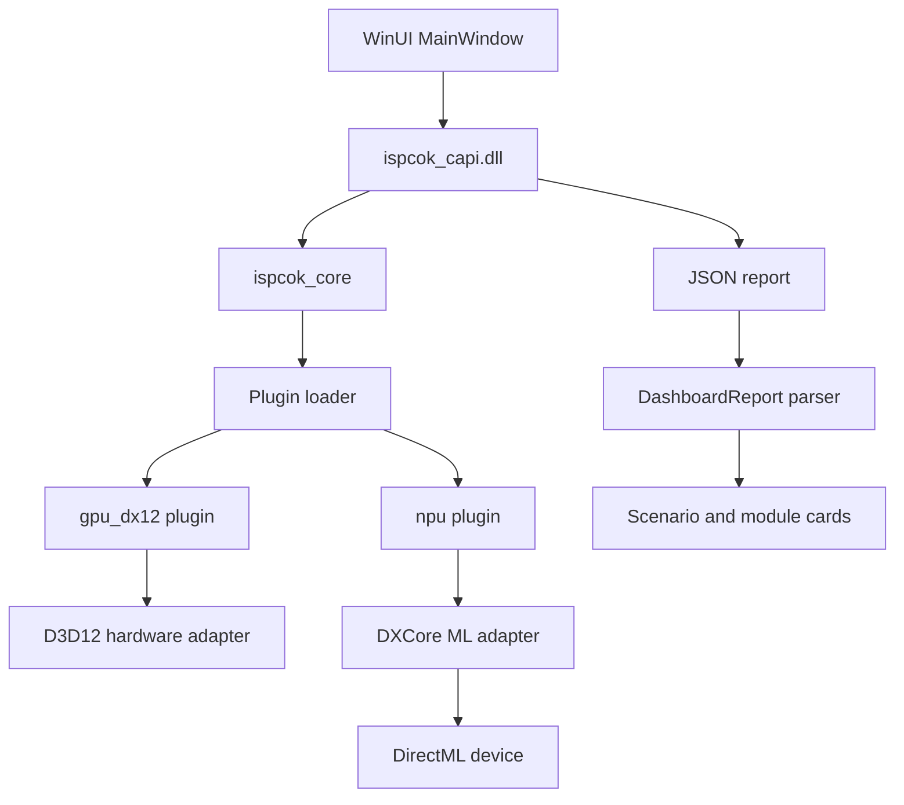

# Windows Dashboard and Accelerators

Feature Name: windows-dashboard-accelerators
Updated: 2026-08-13

## Description

Deliver a card-based WinUI benchmark dashboard together with real Direct3D 12 GPU and DirectML NPU plugins. The implementation preserves the `26h2-0810` generated-XAML startup chain and plugin ABI v1. Windows accelerator APIs remain private dependencies of standalone plugin DLLs.

## Architecture



The benchmark continues to run on a detached worker thread. The worker owns only C API calls and value strings. The dispatcher returns the raw JSON to the UI thread, where `Windows.Data.Json` parses the report and code creates standard WinUI card controls inside XAML-defined containers.

## Components and Interfaces

### Dashboard report model

`DashboardReport.h/.cpp` defines plain C++ structures for module metrics, modules, scenario summary, and parse results. `ParseDashboardReport` uses `Windows.Data.Json`, validates required fields, ignores unknown fields, and converts exceptions into an error value.

### WinUI dashboard

`MainWindow.xaml` retains its generated `x:Class` and named controls. The result area contains a scenario card, a wrapping module card container, a status surface, and an expandable raw JSON text box. `MainWindow.xaml.cpp` dynamically creates cards to avoid new runtime classes, data binding metadata, and changes to the known-good XAML generation chain.

### Direct3D 12 plugin

`plugins/dx12/dx12_backend.cpp` enumerates high-performance adapters, excludes software adapters by default, compiles a fixed compute shader, executes the shared 1024 x 1024 FP32 GEMM, uses timestamp queries, reads the output back, and validates the shared checksum. `ISPCOK_DX12_ALLOW_WARP=1` enables WARP for CI correctness testing.

### DirectML NPU plugin

`plugins/npu/directml_npu_backend.cpp` dynamically loads DXCore, D3D12, and DirectML entry points. It selects a DXCore adapter that supports machine-learning or core-compute capability and lacks graphics capability. The plugin creates a DirectML FP16 GEMM operator, executes a fixed workload, reads a sample result, and reports NPU metrics. API and hardware absence produce `not_supported`; failures after device selection produce `error`.

### Build and packaging

`plugins/CMakeLists.txt` adds Windows-only plugin targets with private SDK dependencies. The release workflow builds, signs when configured, packages, and smoke-tests both plugins. Core targets receive no new SDK links or include paths.

## Data Models

```text
DashboardReport
  version: string
  modules: DashboardModule[]
  scenario: optional DashboardScenario

DashboardModule
  id: string
  category: string
  status: string
  score: double
  plugin: bool
  message: string
  metrics: DashboardMetric[]

DashboardScenario
  id: string
  score: double
  bottlenecks: string[]
```

DX12 metrics use `fp32_gflops`, `elapsed_ms`, and `checksum`. NPU metrics use `fp16_gflops`, `elapsed_ms`, and `checksum`. Both plugins include adapter identification in the success message.

## Correctness Properties

1. Every successful dashboard card corresponds to exactly one module in the parsed report.
2. Dashboard parsing preserves every finite metric value and ignores unknown fields.
3. UI controls are created and updated only on the WinUI dispatcher thread.
4. A DX12 result reaches `ok` only after the output checksum matches the host reference.
5. A WARP result is possible only when the diagnostic environment option is enabled.
6. An NPU result reaches `ok` only after selection of a non-graphics ML/core-compute adapter and successful DirectML execution.
7. Missing APIs and hardware produce score 0 with a non-empty degradation message.
8. Windows accelerator SDK dependencies remain confined to plugin DLL targets.

## Error Handling

| Condition | Result |
|---|---|
| C API missing | Dashboard starts and displays an initialization error |
| Invalid JSON | Dashboard displays parse error and raw JSON |
| No D3D12 hardware adapter | `gpu_dx12` returns `not_supported` |
| DX12 dispatch or checksum failure | `gpu_dx12` returns `error` |
| DXCore or DirectML unavailable | `npu` returns `not_supported` |
| No non-graphics ML adapter | `npu` returns `not_supported` |
| NPU execution or validation failure | `npu` returns `error` |
| Window closes during run | Weak window reference prevents UI access |

## Test Strategy

- Parse valid reports with and without scenario data, malformed reports, unknown fields, all module statuses, and Unicode messages.
- Validate dashboard state transitions and rendering for empty and populated reports.
- Build and run existing Linux tests with Windows plugins skipped.
- Build both plugins on `windows-2022`.
- Run `gpu_dx12` with WARP enabled and assert positive throughput plus checksum.
- Run `npu` on the hosted runner and assert plugin-loaded `not_supported` behavior.
- Run the packaged WinUI startup/window stability smoke test.
- Verify final ZIP plugin presence and Authenticode signatures when signing is enabled.

## References

[^1]: (apps/ISmyPCok.WinUI/MainWindow.xaml.cpp) - Existing background C API execution and generated-XAML startup path.
[^2]: (src/core/json_writer.cpp) - Core report JSON contract.
[^3]: (include/ispcok/plugin_api.h) - Plugin ABI v1.
[^4]: (plugins/common/matmul_workload.h) - Shared GPU workload and checksum.
[^5]: (plugins/CMakeLists.txt) - Optional plugin build integration.
[^6]: (https://learn.microsoft.com/windows/win32/direct3d12/direct3d-12-programming-guide) - Direct3D 12 programming guide.
[^7]: (https://github.com/microsoft/DirectML/tree/master/Samples/DirectMLNpuInference) - DirectML NPU adapter and inference sample.
